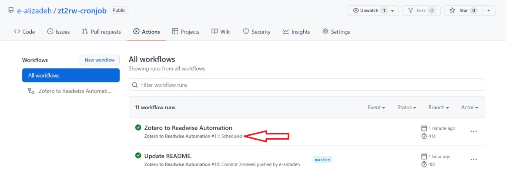

# Zotero2Readwise-Sync 
[](https://github.com/e-alizadeh/Zotero2Readwise-Sync/actions/workflows/automation.yml/badge.svg)

This repo has actually a cronjob (time-based Job scheduler) using GitHub actions that automates the Zotero -> Readwise 
integration using the [Zotero2Readwise](https://github.com/e-alizadeh/Zotero2Readwise) Python library. 

# Instructions
**You just need to fork this repository and add the following secrets to your git repository secrets, 
and you're ready to go!**
- Readwise Access Token (secret name: **READWISE_TOKEN**)
- Zotero Key (secret name: **ZOTERO_KEY**)
- Zotero Library ID (secret name: **ZOTERO_ID**)

Check the [Section Usage](https://github.com/e-alizadeh/Zotero2Readwise#usage) in [Zotero2Readwise](https://github.com/e-alizadeh/Zotero2Readwise) repo to get 
instructions on how to find above information. 

*Note that since Readwise token and Zotero Key's are sensitive information, they should be treated as your passwords.
Because of this, I'm using GitHub Action secrets to manage such sensitive variables!*

# Change the scheduled automation
You can run Zotero2Readwise automation at any repeated schedule by changing the *cron schedule expression*. 
Check [crontab guru](https://crontab.guru/) or [crontab](https://crontab.tech/) (has some examples) for more details. 

Once you come up with the desired schedule, update the cron argument in `.github/workflows/automation.yml` file given below.
*Don't forget the double quote around the expression!* 

```yaml
  schedule:
    - cron: "0 3 * * 1,3,5"
```
*Above is the default schedule I've set up to run the automation.*
The cron expression means to run the automation **at 03:00 AM every Monday, Wednesday, and Friday**. 
You can change the schedule as you wish. Just make sure that your cron job expression is valid by checking 

A scheduled GitHub Action will show **scheduled** next to the deployment as can be seen below. 



# How to add secrets to your repo's GitHub Actions secrets


# Manual Trigger
If you want to manually trigger the automation, you can simply commit an empty message and push it to your forked repo, 
like the following:
```shell
git commit --allow-empty -m "Trigger automation"
```
and then,
```shell
git push
```
This will run the automation immediately and won't impact your scheduled automation.

# Note
*Keep in mind that GitHub Actions may run the scheduled automation with some delay (sometimes with one-hour delay!).*

# 📫 How to reach me:
<a href="https://ealizadeh.com" target="_blank"></a>
<a href="https://www.linkedin.com/in/alizadehesmaeil/" target="_blank"></a>
<a href="https://medium.ealizadeh.com/" target="_blank"></a>
<a href="https://twitter.com/intent/follow?screen_name=es_alizadeh&tw_p=followbutton" target="_blank"></a>

<a href="https://www.buymeacoffee.com/ealizadeh" target="_blank"></a>
